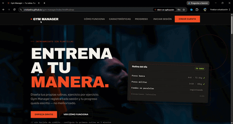
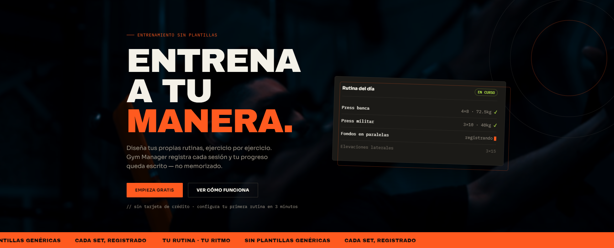
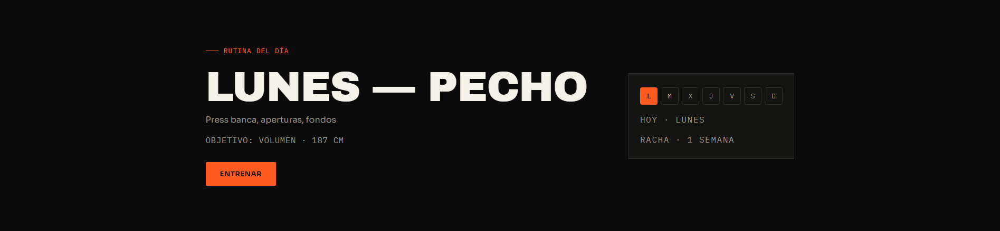
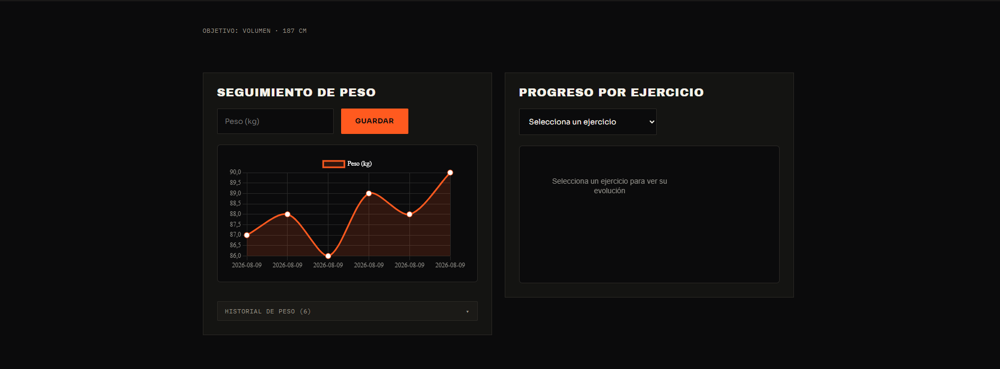

# Gym Manager

Aplicación web (PWA) para diseñar tus propias rutinas de entrenamiento y registrar cada set con peso y repeticiones reales. Sin plantillas genéricas: tú decides qué entrenas, cuándo y cómo lo mides.

## Demo



## Características

- **Registro por set** — marca cada serie con el peso y las repeticiones reales que hiciste.
- **Rutina del día** — plan semanal automático según tu horario (editable día a día, con descansos).
- **Rutinas personalizadas** — crea las tuyas, y también clona/edita las rutinas por defecto.
- **Historial detallado** — cada sesión guardada con los ejercicios, series y pesos; expandible sesión por sesión.
- **Gráfica de progreso por ejercicio** — evolución del mejor set (kg) a lo largo del tiempo.
- **Seguimiento de peso corporal** — gráfica de tu peso registrado.
- **Perfil de usuario** — objetivo (fuerza, volumen, pérdida de peso…) y altura para contextualizar tu progreso.
- **Exportar / importar** — backup completo de tus datos en un JSON, con recordatorio periódico.
- **Offline / instalable** — funciona sin conexión y se instala en la pantalla de inicio (PWA).
- **Temporizador de descanso** — con aviso sonoro integrado en la sesión.

## Capturas







## Cómo correrlo localmente

Es un proyecto 100% estático. Solo abre `index.html` en el navegador:

```bash
# opción 1: abre directo
index.html

# opción 2: servidor local con Python
python -m http.server 8000
# luego entra a http://localhost:8000

# opción 3: Live Server en VS Code
# botón derecho sobre index.html → "Open with Live Server"
```

> El service worker (offline) requiere servir sobre `http://localhost` o HTTPS (funciona en GitHub Pages/Netlify, no al abrir el archivo directo).

## Tests

```bash
npm test
```

Tests de lógica pura usando Node.js test runner. Cubre las funciones principales:
- **mejoresSetsHistorial** — mayor peso por ejercicio en todo el historial
- **rachaSemanas** — semanas consecutivas con entrenamiento
- **getProgresoEjercicios** — evolución del mejor set por ejercicio y fecha

## Estructura del proyecto

```
gym-manager/
├── index.html              # Landing pública + app logueada
├── entrenamientos.html     # Historial y gráficas
├── 404.html                # Página de error personalizada
├── sw.js                   # Service worker (PWA/offline)
├── manifest.webmanifest    # Manifest de instalación
├── package.json            # Configuración de tests
├── css/
│   └── styles.css
├── js/
│   ├── ui.js               # Toasts, confirmación y cierre con Escape
│   ├── utils.js            # Helpers compartidos (auth, storage, menú)
│   ├── data.js             # Rutinas y horario por defecto
│   ├── script.js           # Lógica principal (app + landing)
│   └── script-entrenamientos.js  # Historial y gráficas (Chart.js)
├── tests/
│   └── functions.test.mjs  # Tests de lógica pura (Node.js test runner)
├── assets/
│   ├── brand/              # Favicon e íconos PWA (SVG + PNG 32/180/192/512)
│   ├── icons/              # Íconos SVG de las características
│   ├── images/             # Imágenes estáticas (poster, og-image)
│   └── videos/             # Clips de fondo (hero + banner, 16:9)
└── docs/
    ├── demo.gif            # Demo animada de la aplicación
    └── screenshots/        # Capturas del proyecto (landing, app, historial, modales)
```

## Tecnologías

- HTML, CSS y JavaScript vanilla
- [Chart.js](https://www.chart.js.org/) para las gráficas
- localStorage para persistencia (los datos viven en el navegador del usuario)
- Service Worker + Web App Manifest para PWA

## Nota de seguridad

Este proyecto usa `localStorage` para persistir datos, incluyendo credenciales de usuario. Las contraseñas se almacenan en texto plano y la autenticación es completamente client-side. **No está diseñado para uso en producción ni para manejar datos sensibles.** Es una aplicación de demostración técnica.
